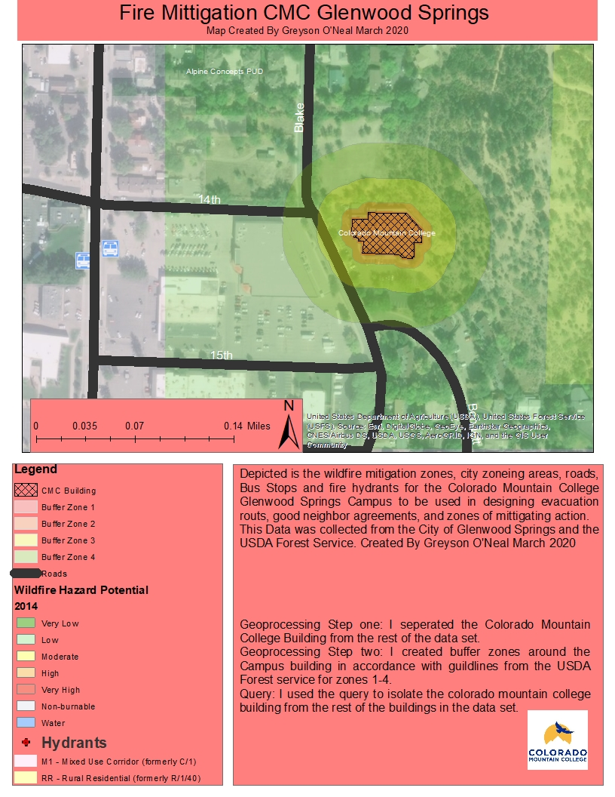

# Greyson's GIS Portfolio
Greyson O'Neal is a student at Colorado Mountain college, majoring in Sustainability studies with addition course work in biology, Outdoor Education and Land Managment. This webpage contains GIS maps produced with a brief description of the project. 
## CMC Glenwood Fire Preparedness Map
This project was completed asa combintation project for Natural Disasters course work and GIS course work. The map depicts fire management zones, fire hydrants, zoneing, and potential areas of excape. This project was completed with the intent of showing what management practices should be undertaken on campus for different zones, and to show the areas of responsibility for management. 

